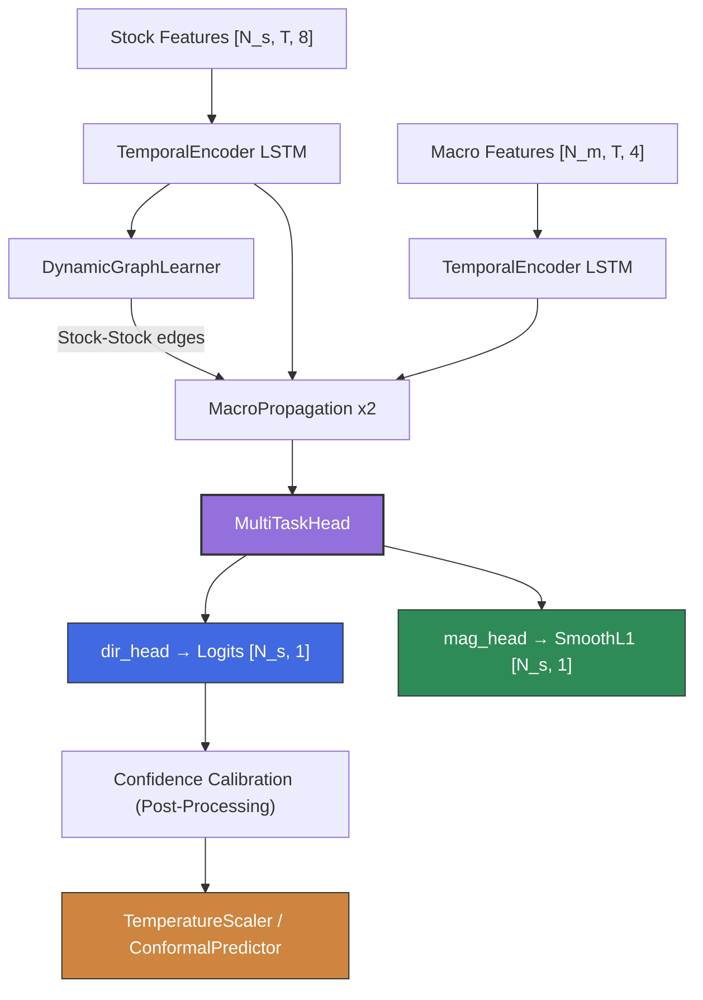

# DGRCL_Strategy

Macro-Aware Dynamic Graph Relation Contrastive Learning (DGRCL) **v1.6** — Multi-Task Learning for market-neutral trading with regime-adaptive training and confidence calibration.

## Overview

A Heterogeneous Graph Neural Network that models the stock market as a graph where:

-   **Stock nodes** represent individual equities with technical features
-   **Macro nodes** represent macroeconomic factors (Oil, Yields, VIX, Currency) as first-class graph citizens

In **v1.6**, the model builds on v1.5's pairwise ranking with **11 quant-analysis-driven improvements**:

1.  **Direction**: Predicting relative alpha (ranking) within sectors using a pairwise margin loss.
2.  **Magnitude**: Predicting absolute return size using log-scaled targets with **adaptive λ** (Rec 4).
3.  **Regime-Adaptive Training**: Per-fold regime classification (calm/normal/crisis) that adjusts early stopping patience and magnitude weight dynamically (Recs 3, 4, 7).
4.  **Confidence Calibration**: Temperature/Platt scaling + conformal prediction sets for honest uncertainty quantification (Recs 2, 6).
5.  **NaN Stability**: Tightened gradient clipping (0.5), NaN-guarded training steps, and per-fold GradScaler reinitialization (Rec 1).

## Documentation

-   [**Methodology**](docs/methodology.md): Graph architecture, Pairwise Ranking Loss, Log-Scaled Magnitude, v1.6 regime-adaptive training, and calibration.
-   [**Setup Guide**](docs/setup_guide.md): Installation, environment setup, and data ingestion.
-   [**Backtesting**](docs/backtesting.md): Walk-forward validation, metrics (Rank Accuracy, Mag MAE, L/S Alpha), and regime-specific results.
-   [**Deep Evaluation & Roadmap**](docs/future_roadmap_and_evaluation.md): v1.6 performance analysis and remaining roadmap items.
-   [**API Reference**](docs/api_reference.md): Code documentation for `MacroDGRCL`, training functions, and `confidence_calibration.py`.

## Key Features (v1.6)

-   **Sector-Aware Pairwise Ranking**: Ranks stocks *within the same sector* using `MarginRankingLoss(margin=0.5)`.
-   **Log-Scaled Magnitude**: Predicts `log(1 + |return|/σ)` with SmoothL1 loss.
-   **Adaptive λ (Rec 4)**: Magnitude loss weight scales with realized volatility: `λ = 0.05–0.15`.
-   **Dynamic Patience (Rec 3)**: Early stopping patience doubles in crisis regimes (vol > 0.50).
-   **Regime Classification (Rec 7)**: Each fold tagged calm/normal/crisis based on trailing cross-sectional return volatility.
-   **MC Dropout Median Rank (Rec 5)**: Median rank across 10 MC passes for stable stock selection.
-   **L/S Alpha (Rec 8)**: Per-fold sector-balanced long-short alpha computed and tracked.
-   **Confidence Calibration (Recs 2, 6)**: `confidence_calibration.py` — Temperature Scaling, Platt Scaling, Conformal Prediction.
-   **NaN Guard (Rec 1)**: `max_grad_norm=0.5`, NaN batch skipping, per-fold `GradScaler` reset.

## Architecture



**Loss**: `L_total = MarginRankingLoss(dir) + λ(σ) · SmoothL1Loss(mag)` where λ adapts per fold.

## Quick Start

### 1. Install
```bash
python3 -m venv venv
source venv/bin/activate
pip install torch torch_geometric pandas numpy matplotlib seaborn yfinance
```

### 2. Get Data
```bash
python3 data_ingest.py  # Downloads S&P 500 + Macro (2021-Present)
```

### 3. Train (Full Pipeline)
```bash
# AMD GPU (sets ROCm env vars automatically):
bash run_gpu_training.sh --real-data --save-calibration-data

# CPU / NVIDIA:
python3 train.py --real-data --save-calibration-data
python3 confidence_calibration.py --results-dir ./backtest_results
```

### CLI Arguments

| Flag | Description |
|------|-------------|
| `--real-data` | Use real market data from `./data/processed/` |
| `--save-calibration-data` | Save val logits/labels for confidence calibration |
| `--start-fold N` | Resume from fold N (1-based) |
| `--end-fold N` | Stop at fold N (inclusive) |
| `--mag-weight 0.05` | Override base λ (adaptive scaling still applies) |
| `--epochs 100` | Max epochs per fold |
| `--output-dir DIR` | Results directory (default: `./backtest_results`) |
| `--ablation VARIANT` | Feature ablation experiment |

## Testing

```bash
source venv/bin/activate
pytest test_macro_dgrcl.py -v   # 58 tests
```

## Project Structure

```
├── macro_dgrcl.py              # Model: MacroDGRCL (HeteroGNN + MultiTaskHead)
├── train.py                    # Training: walk-forward backtest engine (v1.6)
├── confidence_calibration.py   # Post-processing: Recs 2 & 6 (calibration + conformal)
├── data_ingest.py              # Data download + feature engineering
├── data_loader.py              # Snapshot creation + walk-forward fold splitter
├── test_macro_dgrcl.py         # 58 unit tests
├── run_gpu_training.sh         # Full pipeline script (AMD GPU)
├── docs/                       # Documentation
│   ├── methodology.md
│   ├── backtesting.md
│   ├── api_reference.md
│   ├── setup_guide.md
│   └── future_roadmap_and_evaluation.md
└── backtest_results/           # Output: plots, checkpoints, calibration artifacts
```

## License

MIT
