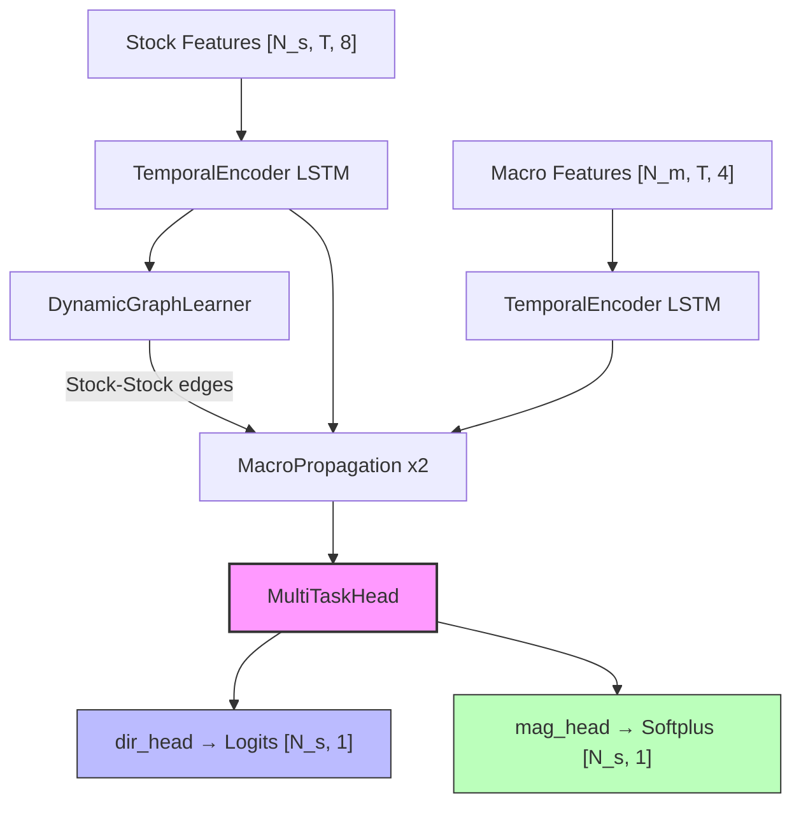

# DGRCL_Strategy

Macro-Aware Dynamic Graph Relation Contrastive Learning (DGRCL) **v1.3** — Multi-Task Learning for market-neutral trading.

## Overview

A Heterogeneous Graph Neural Network that models the stock market as a graph where:

-   **Stock nodes** represent individual equities with technical features
-   **Macro nodes** represent macroeconomic factors (Oil, Yields, VIX, Currency) as first-class graph citizens

The model decouples **direction prediction** (will a stock outperform the cross-sectional median?) from **magnitude prediction** (how large is the absolute return?) via a shared-backbone Multi-Task Learning head.

## Key Features

-   **Heterogeneous Graph Topology**: Two node types (Stock, Macro) with hybrid edge connections
-   **Dynamic Edge Learning**: Stock→Stock adjacency computed via self-attention at each timestep
-   **Custom Message Passing**: Dual aggregation from stock neighbors and macro factors
-   **Multi-Task Head**: Shared representation with separate direction (BCE) and magnitude (MSE + Softplus) heads
-   **Early Stopping**: Monitors combined validation loss to prevent overfitting

## Architecture



**Loss**: `L_total = BCEWithLogitsLoss(dir) + λ · MSELoss(mag)`

## Installation

```bash
# Create virtual environment
python -m venv venv

# Activate
source venv/bin/activate   # Linux/Mac
.\venv\Scripts\activate     # Windows

# Install dependencies
pip install torch torch_geometric pytest
```

## Usage

```python
from macro_dgrcl import MacroDGRCL

# Initialize model
model = MacroDGRCL(
    num_stocks=50,
    num_macros=4,
    stock_feature_dim=8,
    macro_feature_dim=4,
    hidden_dim=64,
    top_k=10,
    head_dropout=0.3
)

# Forward pass — returns direction logits and magnitude predictions
dir_logits, mag_preds = model(stock_features, macro_features)

# Convert to probabilities
dir_probs = torch.sigmoid(dir_logits)  # P(return > median)
# mag_preds are guaranteed non-negative (Softplus)
```

## Training

```bash
# Train with synthetic data (quick demo)
python train.py

# Train with real market data
python train.py --real-data

# Adjust magnitude loss weight (λ)
python train.py --real-data --mag-weight 0.5
```

> **AMD GPU Note**: If using an AMD GPU (e.g. RX 6600), set `HSA_OVERRIDE_GFX_VERSION=10.3.0` before running.

### Backtesting with Walk-Forward Validation

```bash
# 1. Download and process S&P 500 + macro data
python data_ingest.py

# 2. Run walk-forward backtest (specific fold range)
python train.py --real-data --start-fold 1 --end-fold 5
```

This performs walk-forward cross-validation:
- **Train window**: 200 days
- **Validation window**: 100 days
- **Step**: Advance 50 days between folds
- **Early stopping**: Patience of 15 epochs on combined validation loss

## Testing

```bash
python -m pytest test_macro_dgrcl.py -v
```

## Files

| File                  | Description                                         |
| --------------------- | --------------------------------------------------- |
| `macro_dgrcl.py`      | Core model: GNN backbone + MultiTaskHead            |
| `train.py`            | MTL training loop with EarlyStopping + walk-forward |
| `data_ingest.py`      | S&P 500 + Macro data ingestion                      |
| `data_loader.py`      | CSV→Tensor loader + WalkForwardSplitter             |
| `losses.py`           | Legacy loss functions (v1.2)                        |
| `test_macro_dgrcl.py` | Pytest suite (24 tests)                             |

## License

MIT
