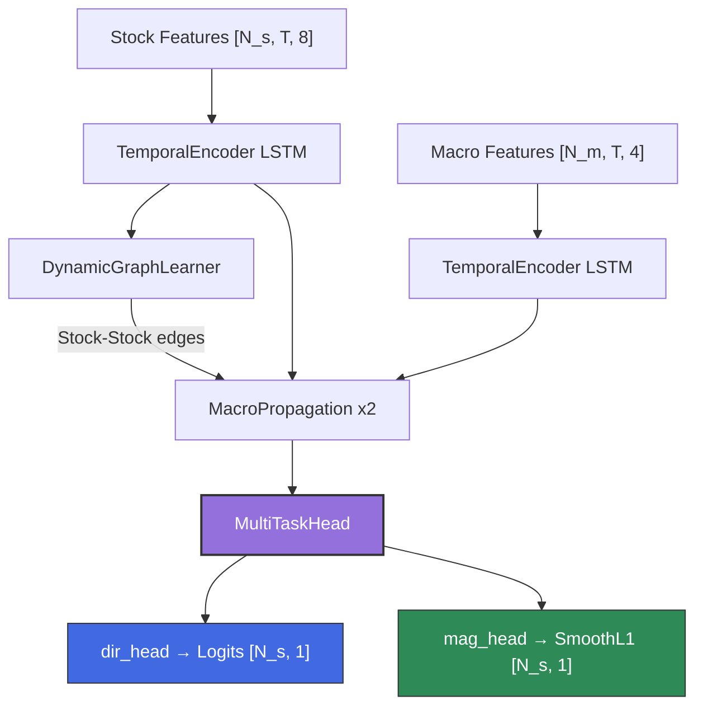

# DGRCL_Strategy

Macro-Aware Dynamic Graph Relation Contrastive Learning (DGRCL) **v1.5** — Multi-Task Learning for market-neutral trading.

## Overview

A Heterogeneous Graph Neural Network that models the stock market as a graph where:

-   **Stock nodes** represent individual equities with technical features
-   **Macro nodes** represent macroeconomic factors (Oil, Yields, VIX, Currency) as first-class graph citizens

In **v1.5**, the model solves training collapse by decoupling learning into:
1.  **Direction**: Predicting relative alpha (ranking) within sectors using a pairwise margin loss.
2.  **Magnitude**: Predicting absolute return size using log-scaled targets.

## Documentation

-   [**Methodology**](docs/methodology.md): Detailed explanation of the Graph architecture, Pairwise Ranking Loss, and Log-Scaled Magnitude prediction.
-   [**Setup Guide**](docs/setup_guide.md): Installation instructions, Environment setup, and Data Ingestion guide.
-   [**Backtesting**](docs/backtesting.md): How Walk-Forward Validation works, interpretation of metrics (Rank Accuracy, Mag MAE), and market regimes.
-   [**Deep Evaluation & Roadmap**](docs/future_roadmap_and_evaluation.md): Detailed performance analysis of v1.5 (Rank Accuracy, Regimes) and future improvements.
-   [**API Reference**](docs/api_reference.md): Code documentation for `MacroDGRCL`, `DynamicGraphLearner`, and training functions.

## Key Features (v1.5)

-   **Sector-Aware Pairwise Ranking**: Learns to rank stocks *within the same sector* instead of predicting raw direction.
    -   *Loss*: `MarginRankingLoss(margin=0.5)` on pairs with >1% return difference.
-   **Log-Scaled Magnitude**: Predicts `log(1 + |return|/σ)` to handle heavy-tailed returns.
    -   *Loss*: `SmoothL1Loss` (Huber).
-   **Heterogeneous Graph Topology**: Two node types (Stock, Macro) with hybrid edge connections.
-   **Dynamic Edge Learning**: Stock→Stock adjacency learned via self-attention at each timestep.
-   **Robust Regularization**: Reduced weight decay (`1e-3`), MC Dropout for uncertainty estimation.

## Architecture



**Loss**: `L_total = MarginRankingLoss(dir) + λ · SmoothL1Loss(mag)`

## Quick Start

### 1. Install
```bash
python -m venv venv
source venv/bin/activate
pip install torch torch_geometric pandas numpy matplotlib seaborn yfinance scikit-learn
```

### 2. Get Data
```bash
python data_ingest.py  # Downloads S&P 500 + Macro (2021-Present)
```

### 3. Train
```bash
python train.py --real-data --start-fold 1 --end-fold 5
```

## Testing

```bash
python -m pytest test_macro_dgrcl.py -v
```

## License

MIT

